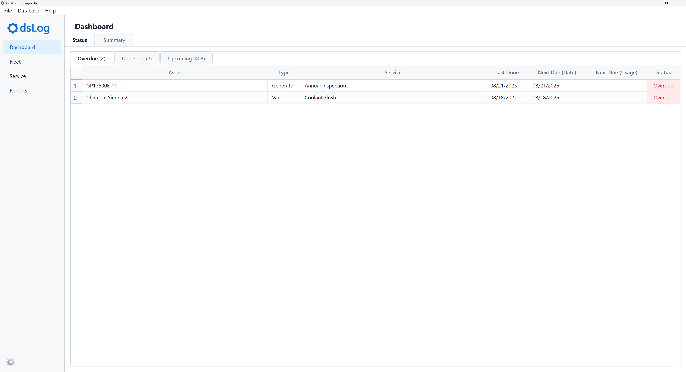
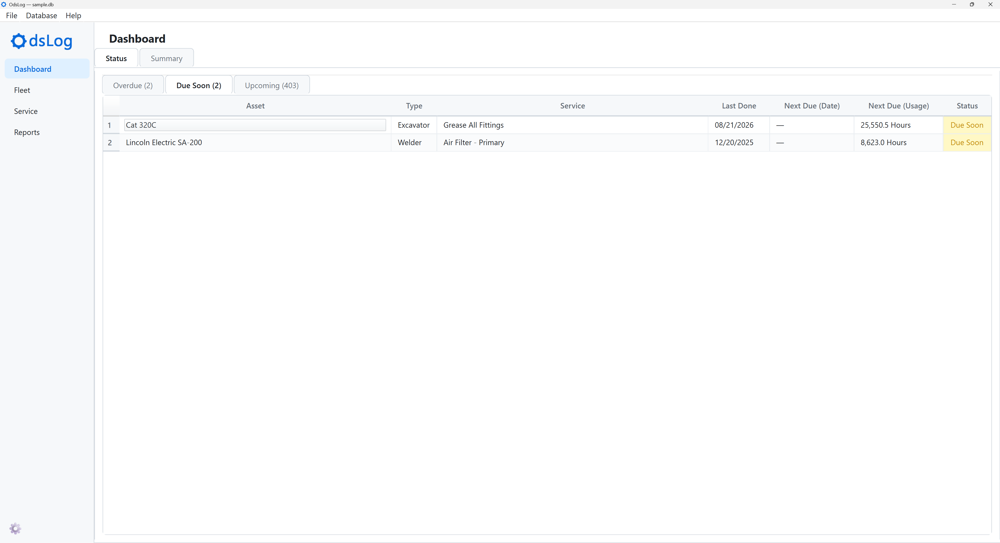
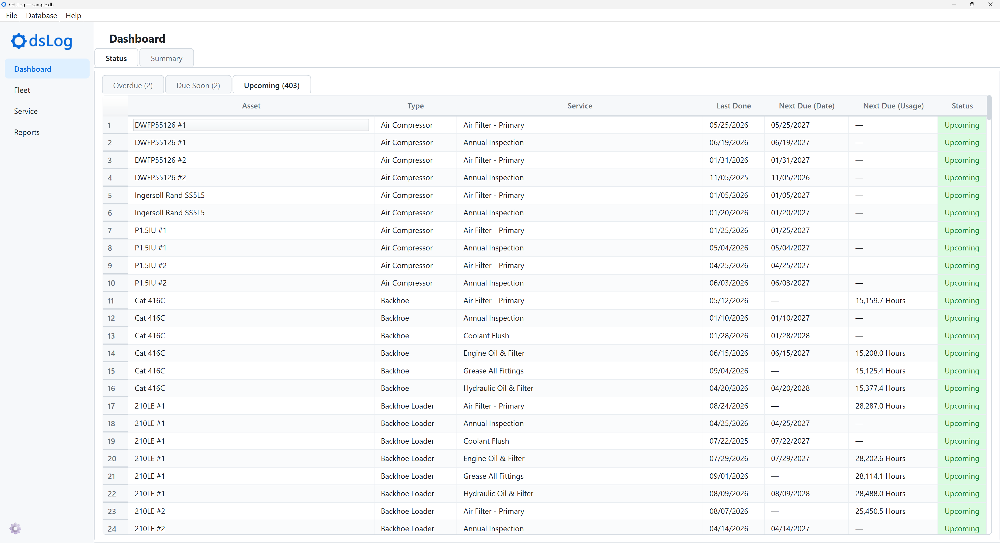
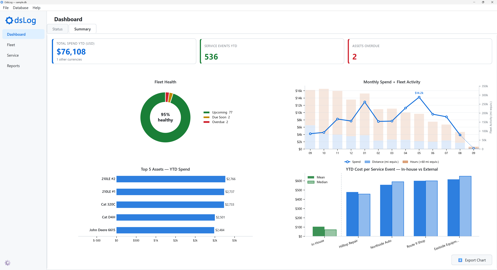

# Dashboard

The Dashboard is the first screen OdsLog shows when a database opens. It has two tabs:

- **Status**: a live worklist of what needs attention.
- **Summary**: a set of fleet-wide KPIs and charts.

## Status Tab

Three sub-tabs, one per status. Rows are scheduled items, not assets. An asset due for three services appears as three separate rows, one per service.

- **Overdue**: the due date has passed, or the due usage amount has been reached or exceeded.
- **Due Soon**: within the reminder window configured on that schedule item (see [Fleet](fleet.qmd)), or, absent an explicit reminder, within the due-soon threshold percentage of the interval set under [Database Details](menus-and-sidebar.qmd#database-menu).
- **Upcoming**: everything else.

Columns: Asset, Type, Service, Last Done, Next Due (Date), Next Due (Usage), Status. Each status has its own color, carried through the rest of the app. The same three colors mark status in [Fleet](fleet.qmd) and [Reports](reports.qmd).

::: {.panel-tabset}
## Overdue

## Due Soon

## Upcoming

:::

## Summary Tab

Three KPI cards, all calendar-year-to-date:

- **Total Spend YTD (USD)**: totals only USD-denominated service costs. A note below the figure flags when other currencies were excluded from the total.
- **Service Events YTD**: total number of service events logged.
- **Assets Overdue**: number of assets with overdue services.

Below the KPIs, four charts:

- **Fleet Health**: a donut chart of assets by worst status, each asset counted once under its single most urgent item.
- **Monthly Spend + Fleet Activity**: a dual-axis chart covering the 12 most recent complete months plus the current, still-in-progress month. 
    - Spend line (left axis): monthly service cost
    - Stacked activity bars (right axis): distance and hours logged that month, with hours placed on a mile-equivalent scale (1 hour = 60 miles), so both stack on the same axis
    - In-progress month: shown with a different style (dotted line, hatched bars) since its totals aren't final yet
- **Top 5 Assets -- YTD Spend**: the five highest-spending assets so far this year.
- **YTD Cost per Service Event -- In-house vs External**: mean and median cost per event, grouped by company and split between in-house work and outside shops.

**Export Chart**: saves the current chart layout as a PNG or JPEG image.

