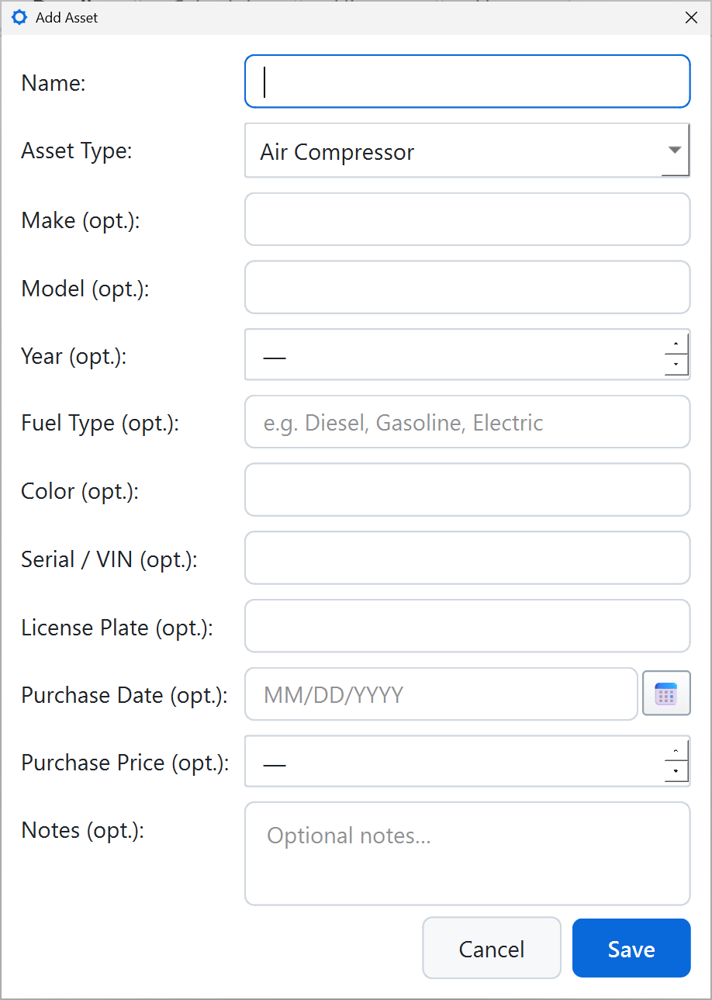
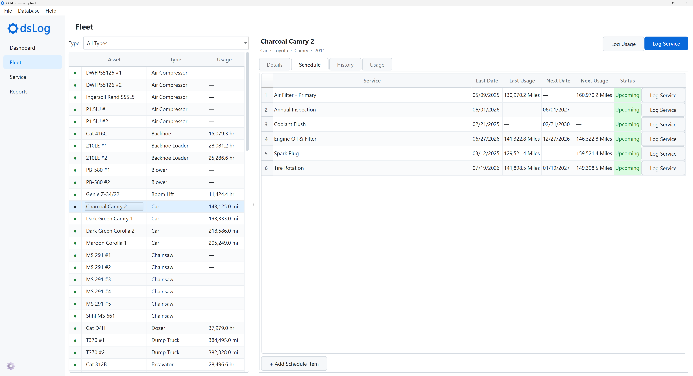
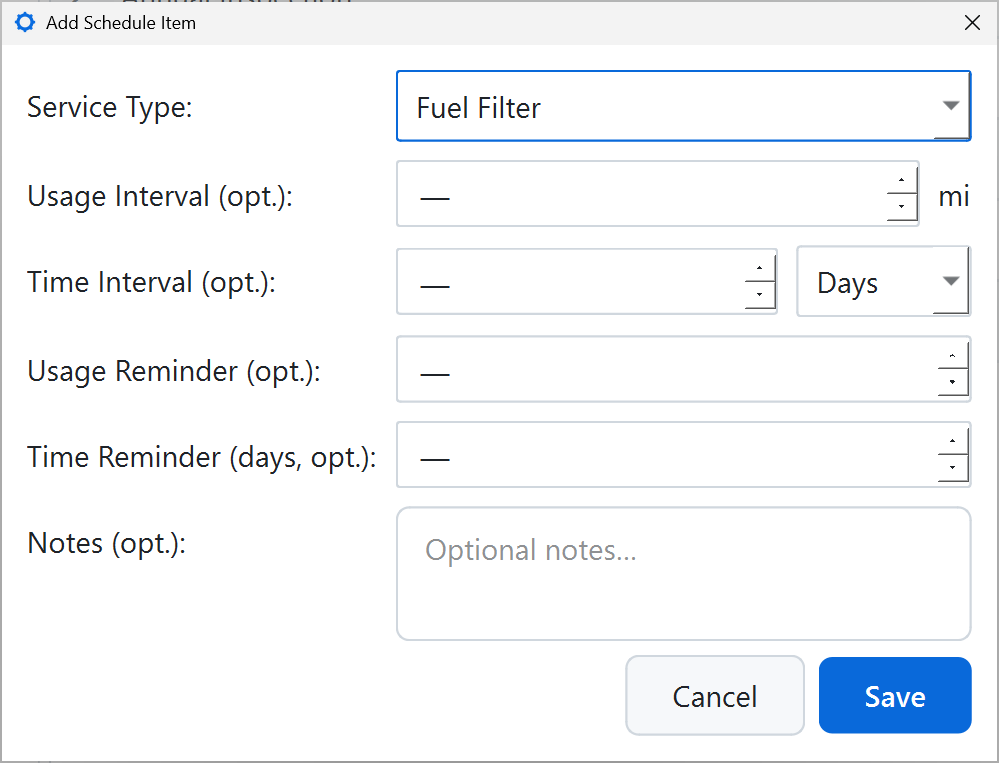
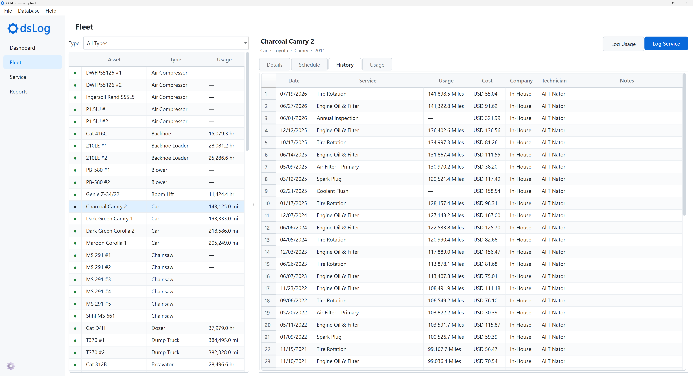
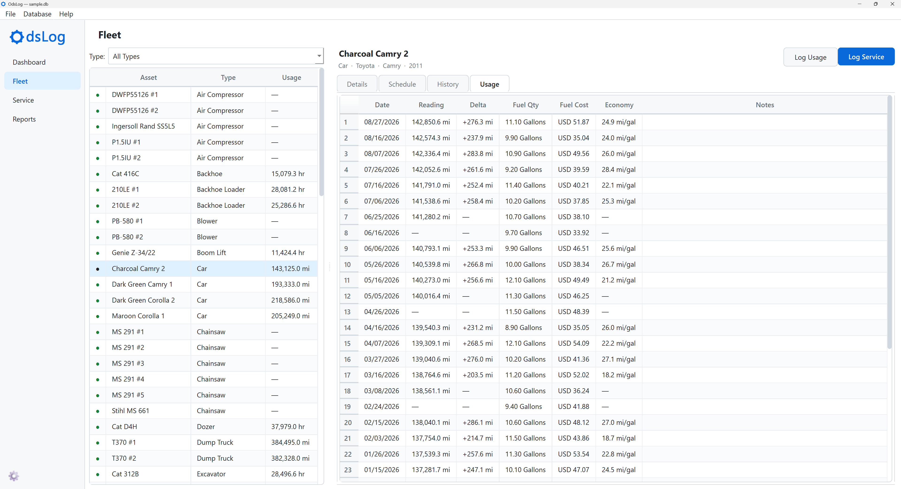
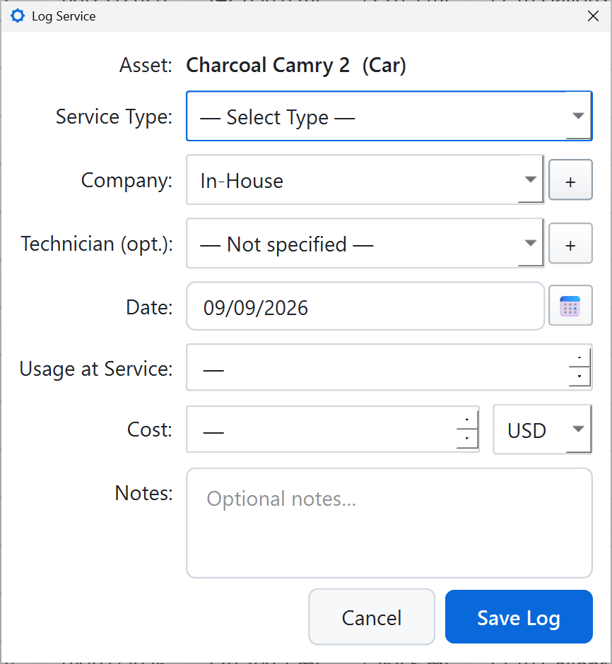
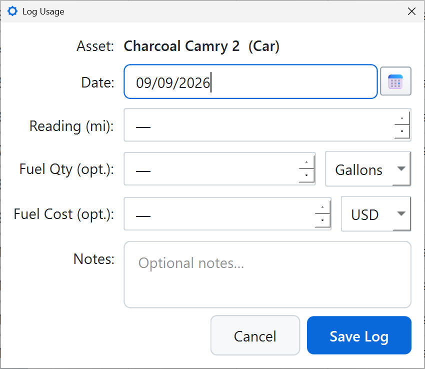

# Fleet

The Fleet screen is where individual assets live: the list of all assets on the left, a detail panel on the right for whichever asset is selected.

## Asset List

- **Columns**: a status dot, Asset, Type, Usage.
- **Type**: filters the list to one Asset Type at a time.
- Right-click the list for **+ Add Asset**.

### Add Asset

- **Name**: your own identifier for this specific asset (e.g. "Truck 12," "Blue Excavator")
- **Asset Type**: choose an existing type, or create one inline via **+ Create New Asset Type…** without leaving the dialog.
- **Make, Model, Year, Fuel Type, Color, Serial / VIN, License Plate** (all optional)
- **Purchase Date, Purchase Price** (both optional)
- **Notes** (optional)

There is no Usage Type field here. Usage Type is inherited from Asset Type. Current usage always starts at 0. Usage is set later through Log Usage.

{width=60%}

## Details Tab

A read-only summary of the selected asset: Name, Type, Make, Model, Year, Serial / VIN, License, Current Usage, Notes.

## Schedule Tab

The asset's own copy of its service intervals, one row per service type.

Columns: Service, Last Date, Last Usage, Next Date, Next Usage, Status, plus a **Log Service** button per row.

Last Usage and Next Usage here track that service type's own due point, from the Usage at Service value entered when logging a service. This tracking is independent of the asset's actual current usage reading (see [Usage Tab](#usage-tab)). Only Log Usage updates the current usage reading.

An asset's Schedule starts as a copy of its Asset Type's Templates (see [Database Structure](database-structure.qmd)) but is independent from that point on. Editing one asset's interval never touches the Template or any other asset.

**+ Add Schedule Item** adds an interval directly to this asset, independent of whether a matching Template exists. This covers one-off services outside the Asset Type's normal Templates and is also the only way to populate a Schedule for an Asset Type with zero Templates.

- **Service Type**: choose an existing type, or create one inline via **+ New Service Type…**.
- **Usage Interval** (opt.), only enabled when the asset has a meter.
- **Time Interval** (opt.), in Days or Months.
- **Usage Reminder** (opt.): an explicit "Due Soon" threshold as a usage amount before the due point, overriding the Database Details percentage for this one item.
- **Time Reminder** (opt.), in days: the "Due Soon" threshold for a date-based interval.
- **Notes** (opt.)

At least one of Usage Interval or Time Interval is required.

{width=60%}

## History Tab

A reverse-chronological log of every service event performed on this asset (newest first): Date, Service, Usage, Cost, Company, Technician, Notes. Right-click a row for **Edit…** or **Archive**.

## Usage Tab

Only shown for assets with a meter (odometer or hour meter). Assets without one show a short explanation in its place.

Columns: Date, Reading, Delta, Fuel Qty, Fuel Cost, Economy, Notes.

Delta and Economy are both computed from the surrounding readings, not stored directly.

Right-click a row for **Edit…** or **Archive**.

## Log Service

Opened from either the **Log Service** header button or a Schedule row's own button (which pre-selects that row's service type).

- **Asset**: fixed, shown read-only -- the asset on a log can't be changed once set.
- **Service Type**
- **Company**: In-house is listed first; a **+** button opens Add Company without leaving the dialog.
- **Technician** (opt.): filtered to the selected company's own technicians; a **+** button opens Add Technician the same way.
- **Date**
- **Usage at Service** (opt.)
- **Cost** (opt.), with a currency selector defaulting to the database's default currency.
- **Notes** (opt.)

{width=60%}

## Log Usage

Opened from the **Log Usage** header button, enabled only for assets with a meter.

- **Date**
- **Reading**, in the asset's usage unit.
- **Fuel Qty** (opt.), with a Gallons/Liters unit selector.
- **Fuel Cost** (opt.), with a currency selector.
- **Notes** (opt.)

{width=60%}
