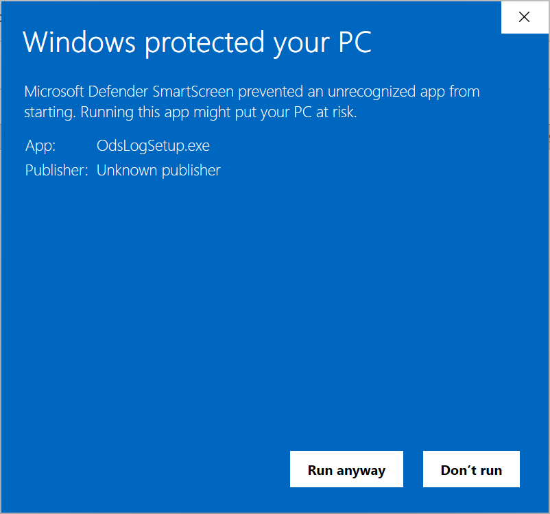
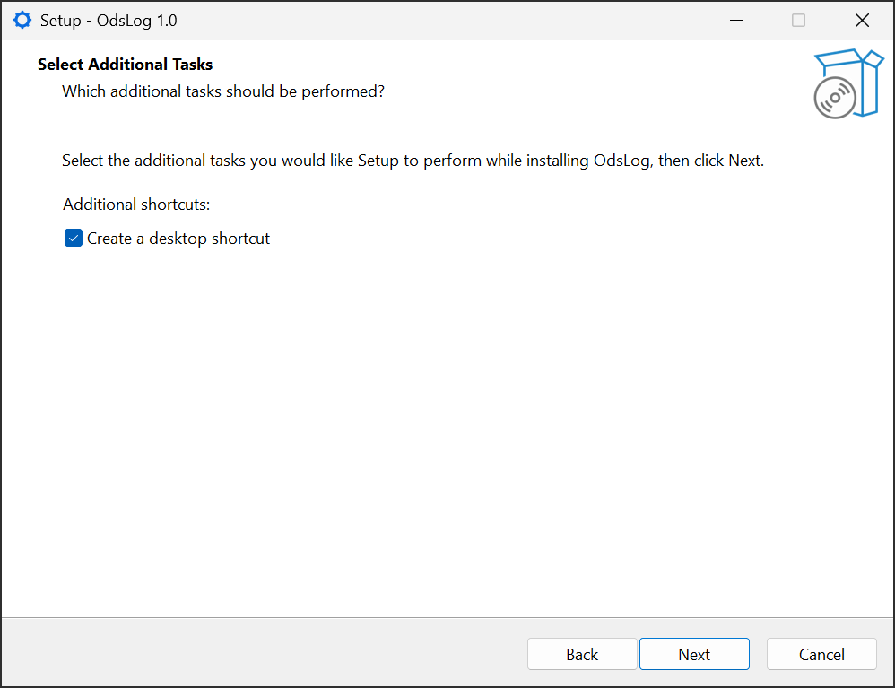
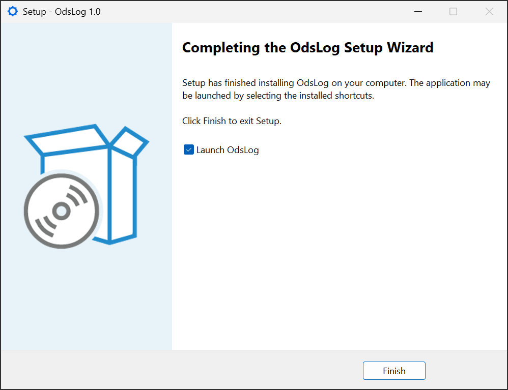
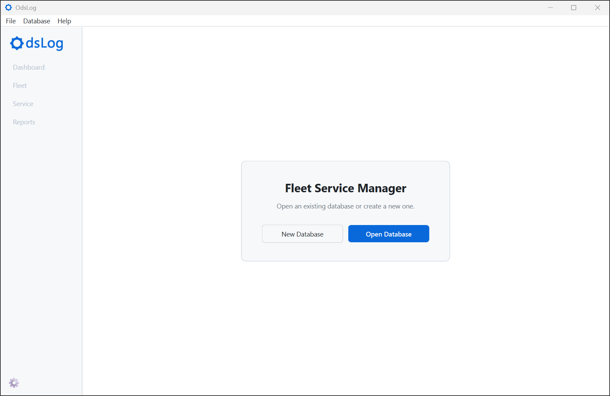

# Getting Started

## Installing OdsLog

1. Download `OdsLogSetup.exe` from the [latest release](https://github.com/oliverdsiu/ods-log/releases/latest).
2. Run the installer.

Windows will very likely show a warning here:

> **Windows protected your PC** \
> Microsoft Defender SmartScreen prevented an unrecognized app from starting. Running this app might put your PC at risk.

{width=60%}

This is expected and not a sign of anything wrong. This warning is standard for any new, independently-published app that isn't code-signed. Click **More info** and then **Run anyway** to continue.

3. Follow the installer through the rest of its steps. The application installs to Program Files, adds a Start Menu entry, and registers a normal Windows uninstaller. A desktop shortcut can optionally be added too.

Once installation finishes, OdsLog can be launched immediately, or later from the Start Menu or desktop shortcut, if one was created.

OdsLog will launch into the Home screen.

That's it for installation.
