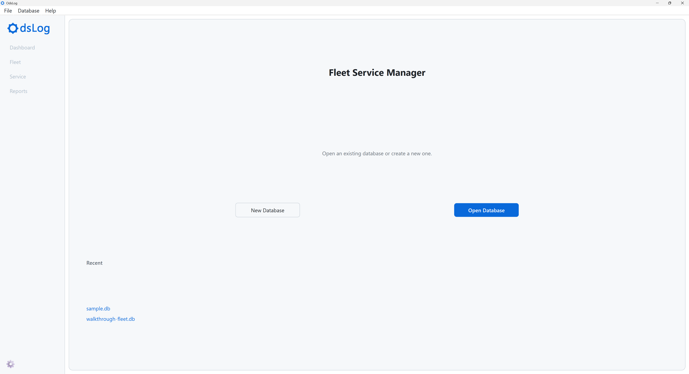
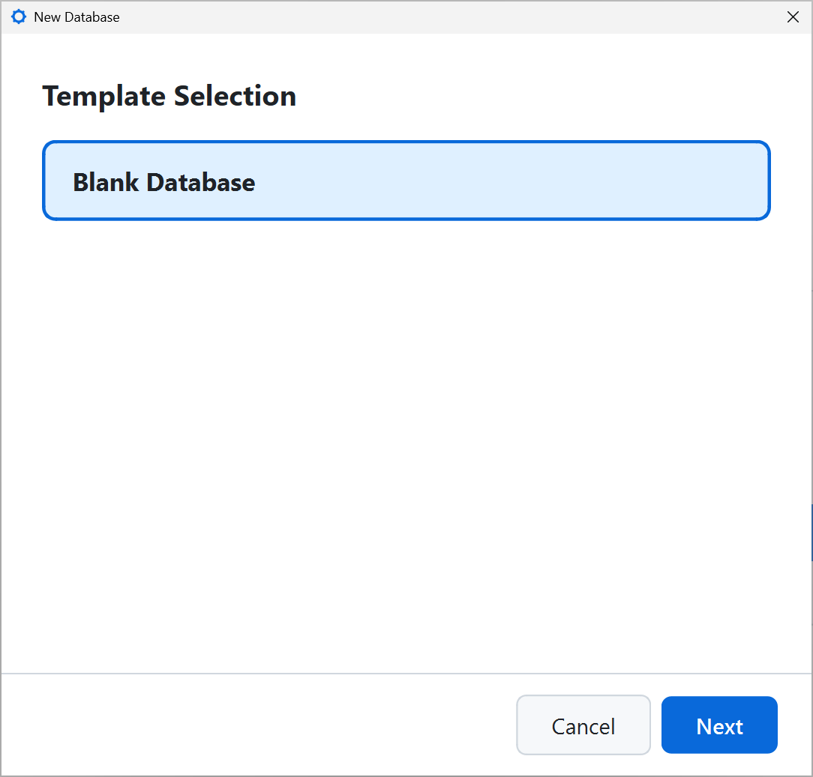
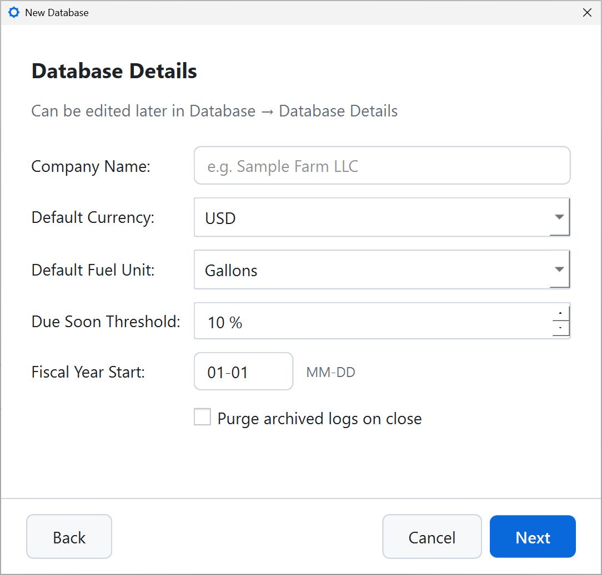

# Home Screen

Upon launch, OdsLog presents a Home screen with three ways to get started: starting a new database, opening an existing one, or jumping straight into a recent database.

## New Database

Starts a blank database and walks through three steps:

1. **Template**: currently a single "Blank Database" option.

{width=60%}

2. **Database details**: your company/operation name, default currency, default fuel unit, the due-soon threshold percentage used by the Dashboard, your fiscal year start, and whether archived logs should be cleared automatically when the database closes.

{width=60%}

3. **Location**: where to save the `.db` file.

Nothing is written to disk until the final step is finished, so cancelling the process at any point leaves no partial file behind.

A blank database starts genuinely empty -- no asset types, no service types, nothing to log against yet. [Walkthrough](walkthrough.qmd) guides you to build a fleet from this starting point, step by step.

## Open Database

Opens an existing `.db` file.

## Recent

Lists previously opened databases. Click on the database name to open it. If a listed file has been moved or deleted, OdsLog will ask whether to remove it from this list.

## Optional: Skip straight to real data

To explore a populated fleet instead of building one from scratch, use [**File → Load Sample Data**](menus-and-sidebar.qmd) to instantly generate a realistic randomized fleet without additional download or setup.
