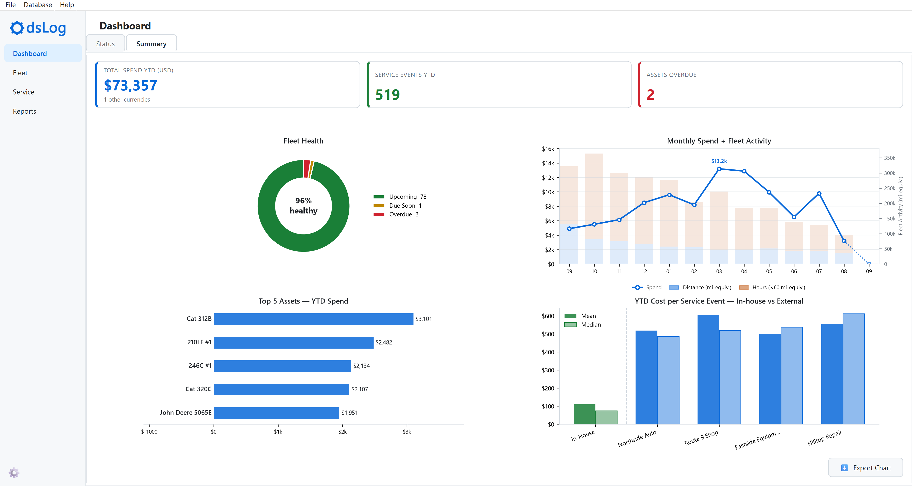

# Welcome {.unnumbered}

OdsLog is a lightweight desktop application for tracking service, cost, and usage across a fleet of anything you own that needs upkeep: vehicles, heavy equipment, generators, hand tools, and anything else you define. This application runs entirely locally, backed by a single SQLite file -- no proprietary format, no account, and no subscription required.

This manual walks through everything from installing the application to a full worked example of building a fleet from scratch.

To start poking around, use **File → Load Sample Data** to instantly generate a realistic, populated fleet in one click, no setup required.

- [Get OdsLog](https://github.com/oliverdsiu/ods-log)
- [Latest release](https://github.com/oliverdsiu/ods-log/releases/latest)
- [Sample database used in this manual](data/sample.db)
