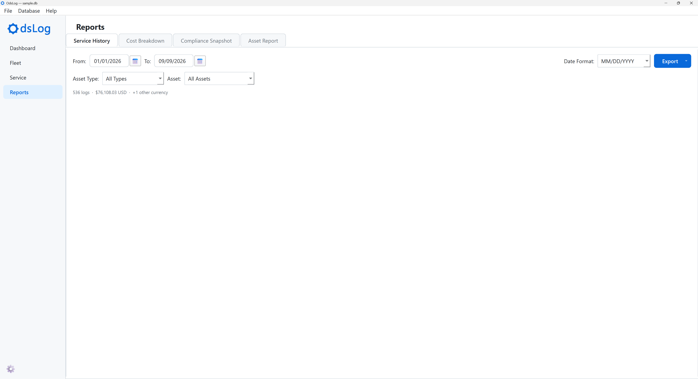
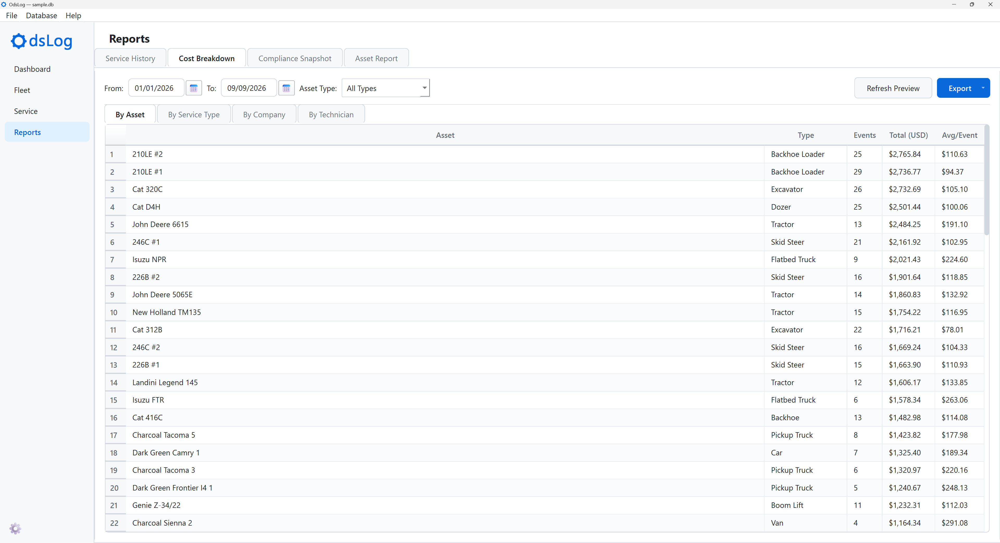
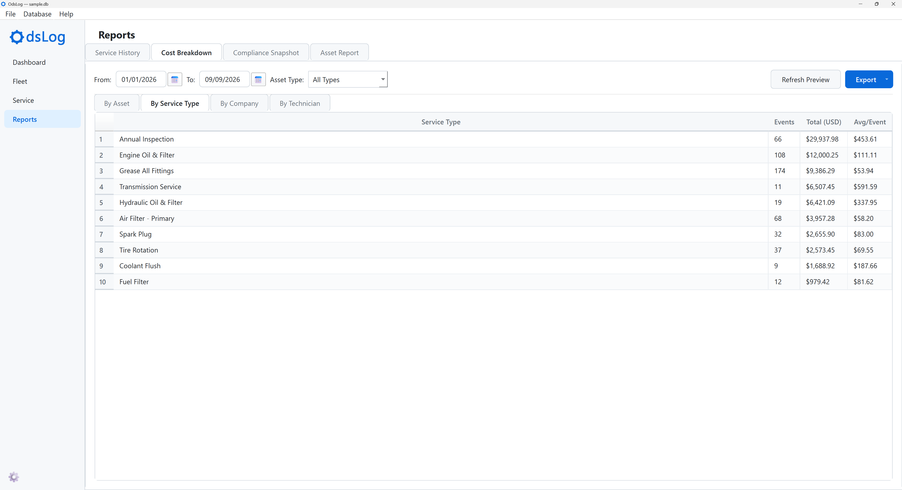
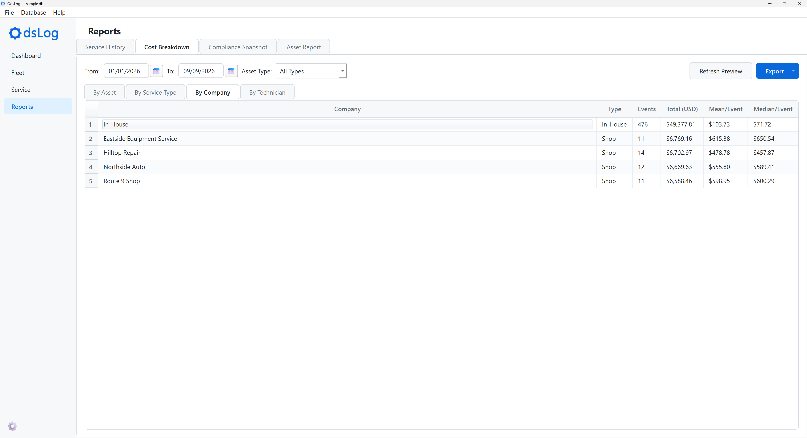
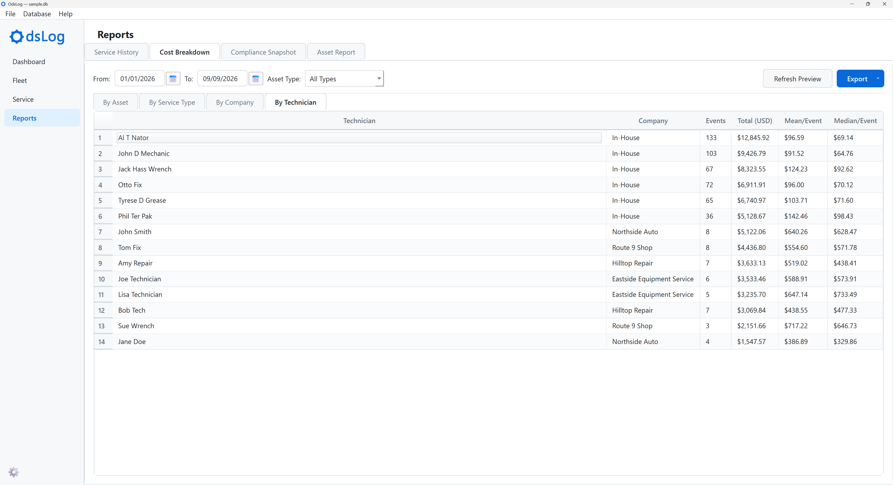
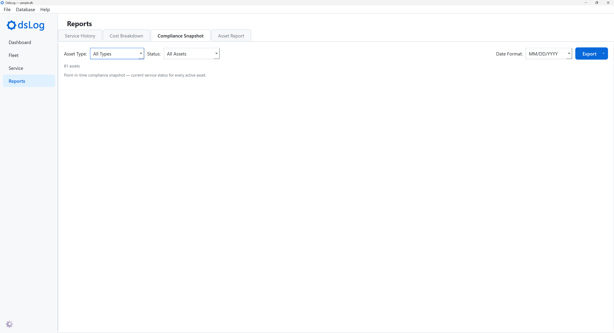

# Reports

The Reports screen consists of four types of reports, each with its own tab.

## Service History

A reverse-chronological export (newest first) of service events in a date range, grouped by month.

- Filters: From/To date range, Asset Type, Asset, and a report-only Date Format selector (separate from the app-wide date format in Settings).
- A summary line shows the matching event count and USD total, flagging other currencies excluded from that total.
- Export: CSV, Excel, or PDF
    - The PDF export groups events by month with a subtotal per month.

## Cost Breakdown

Total and per-event cost broken down four ways, previewed on screen before exporting.

- Filters: From/To date range and Asset Type.
- **Refresh Preview** recomputes all four tables.

Tabs:

- **By Asset**: Events, Total (USD), Avg/Event.
- **By Service Type**: the same, one row per Service Type.
- **By Company**: Events, Total, Mean/Event, Median/Event, covering both in-house work and outside shops.
- **By Technician**: the same, one row per technician.

- Export: a single Excel workbook (one sheet per breakdown) or four separate CSV files to a chosen folder.

::: {.panel-tabset}
## By Asset

## By Service Type

## By Company

## By Technician

:::

## Compliance Snapshot

A point-in-time PDF snapshot of every active asset's service status. Each asset gets its own card, with a border colored by its worst status. Inside the card, a table lists every scheduled item.

- Filters: Asset Type, Status (All Assets / Overdue only / Overdue + Due Soon), and a report-only Date Format selector (separate from the app-wide date format in Settings).
- A summary line shows the matching asset count.
- Export: PDF only.

## Asset Report

Pick which assets and which sections to include, then export.

- Filters: Asset Type, Asset.
- **Sections**, toggled independently:
    - Asset Details
    - Service History
    - Usage Log
    - Full Cost History: service costs and fuel costs combined into one reverse-chronological list (newest first)
- Three levels of bulk selection:
    - **Check All / Uncheck All**: every row and section at once.
    - A column header checkbox: one section, across every row.
    - A row checkbox: every section, for one asset.
- Any bulk selector can be overridden afterward by toggling an individual cell directly.
- Export: CSV (one file per asset per section) or Excel (one workbook per asset, one sheet per section).

