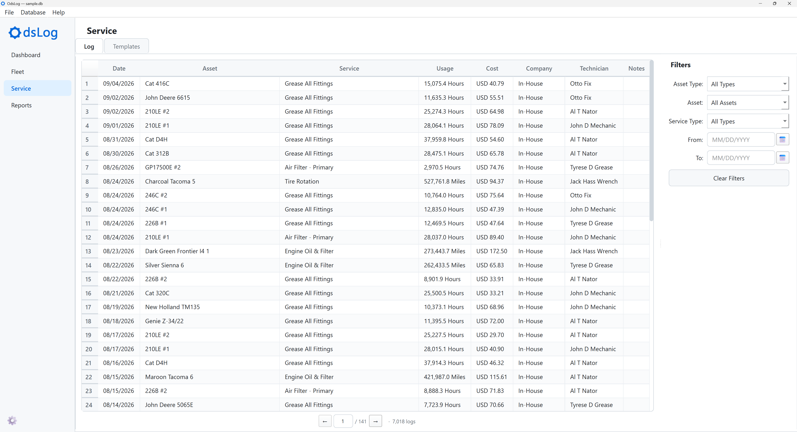

# Service

Where Fleet is organized around one asset at a time, Service takes the fleet-wide view: every service event across every asset, and the Templates that define what each Asset Type expects by default.

## Log Tab

A master, reverse-chronological list (newest first) of every service event across the whole fleet, 50 rows at a time.

Columns: Date, Asset, Service, Usage, Cost, Company, Technician, Notes.

New entries are always created from [Fleet](fleet.qmd)'s Log Service. The **Log** tab is for browsing, filtering, and editing existing entries. Right-click a row for **Edit…**.

**Filters** panel, on the right:

- **Asset Type**: narrows the **Log** list to one Asset Type.
- **Asset**: narrows the **Log** list to one asset. The dropdown's own choices are narrowed to the selected Asset Type, if one is set.
- **Service Type**: narrows the **Log** list to one Service Type. The dropdown's own choices are narrowed to the selected Asset Type, if one is set.
- **From / To**: a date range.

**Clear Filters** resets all of the above at once.

## Templates Tab

Templates set the default schedule for an Asset Type. Each Template pairs a Service Type with a default usage interval, time interval, or both. See [Database Structure](database-structure.qmd) for how Templates relate to an individual asset's own Schedule.

- **Asset Type**: pick one first. This dropdown drives everything else on this tab.
    - **Assets of this type**: a read-only list of every asset belonging to the Asset Type.
    - **Service Templates**: an Asset Type's Templates, one row per Service Type. Interval and reminder columns are editable in place.
        - Columns: Service Type, Usage Interval, Usage Unit, Time Interval, Time Unit, Usage Reminder, Time Reminder
- **+ Add Rule** adds a new Template row for a Service Type not already covered, in a dialog matching Fleet's **+ Add Schedule Item**. Fields:
    - **Service Type**, with inline **+ New Service Type…** creation
    - **Usage Interval** (opt.)
    - **Time Interval** (opt.), in Days or Months
    - **Usage Reminder** (opt.)
    - **Time Reminder** (opt.), in days
    - **Notes** (opt.)

{width=60%}

- **Save Changes**: commits edits to every row in Service Templates at once.

Editing a Template only changes the type-level default going forward and does not touch any existing asset's own Schedule. Existing Schedules are copied at asset creation and stay independent from that point on.

